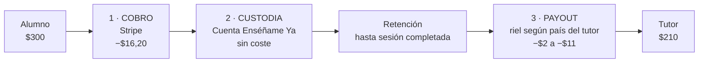
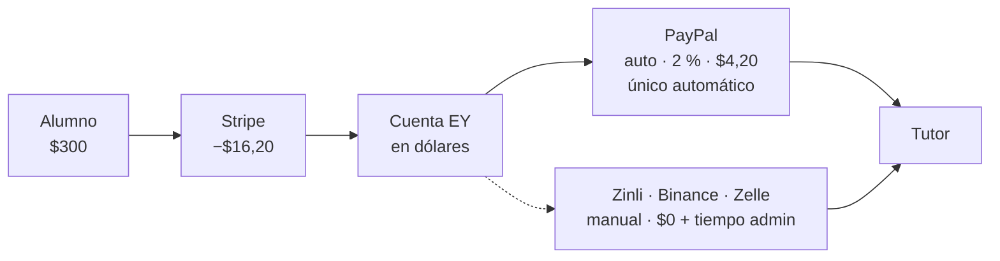
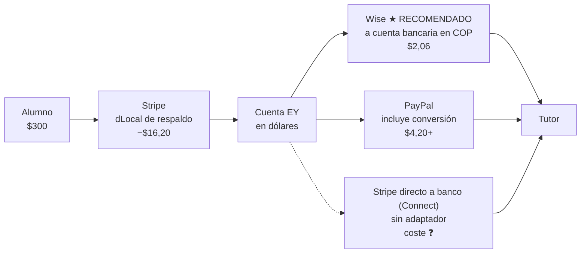
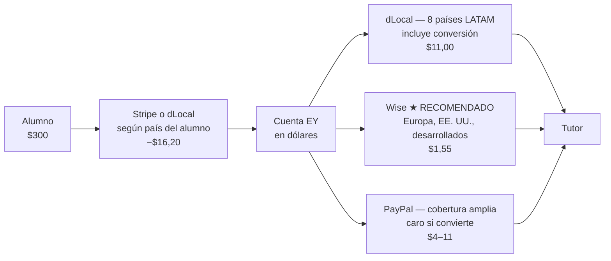

# Enséñame Ya — Pagos y payouts: rutas, costes y quién asume qué

> **Qué es esto.** El mapa completo de cómo entra el dinero y cómo sale, país por país,
> con el coste real de cada tramo. Nace de la ronda de análisis del **1–2 de septiembre de
> 2026** y sustituye a cualquier comparativa de PSPs anterior — en particular al PDF
> «Infraestructura de Pagos» (Emilio, junio-2026), **cuyo eje de análisis es incorrecto**
> (ver §9).
>
> ✅ **PayPal paga (3-sep-2026).** Primer riel de payout automático fuera de dLocal, probado
> de punta a punta contra el sandbox: job → adaptador → lote creado → fila `processing`.
> Detalle en §1.1. **Y Venezuela cobra**: una cuenta de sandbox domiciliada en VE recibió
> un payout con `SUCCESS`, que era la pregunta de la que colgaba automatizar el mercado
> principal. Y una medida que corrige a este documento: PayPal **retiene como
> `UNCLAIMED`** un pago a un correo sin cuenta —el lote dice `SUCCESS` y el dinero NO ha
> llegado—, así que «el lote salió bien» y «el tutor cobró» son cosas distintas.
>
> ✅ **dLocal: cuenta APROBADA, sandbox y producción** (cliente, 4-sep-2026). Este documento
> repitió en cuatro sitios que su cuenta de producción estaba rechazada — venía de un rechazo
> de agosto que ya se resolvió. **No hay ningún PSP bloqueado por cuenta salvo Wise.**
>
> ⚠️ **Nada de esto está en producción, y es deliberado.** El sitio no está lanzado; todo el
> trabajo de pagos se hace contra **dev**. Prod se configura tras la migración de dominio.
>
> ⚠️ **Airtm queda descartada (3-sep-2026)**: Enséñame Ya es una entidad estadounidense.
> Era el payout recomendado de Venezuela y el único camino legal a stablecoin que este
> documento contemplaba, así que **§4 cambia entero**. El mismo día llegaron las credenciales
> de **Wise Business y PayPal Business**: los dos rieles dejan de esperar cuenta y pasan a
> esperar adaptador.
>
> ⚠️ **El flujo de ruteo vigente es el de §1**, fijado por el cliente el **2026-09-03**.
> Sustituye a los mapas anteriores de este documento y al del PDF: las secciones §4–§7
> siguen siendo válidas para los COSTES de cada riel, no para decidir el ruteo.
>
> Entregable comercial derivado de este documento:
> `EnsenameYa-Pagos-y-Payouts.pdf` (10 págs., versión para el cliente).
> ⚠️ **El PDF describe el mapa anterior**: si se vuelve a enviar, hay que regenerarlo.

**Marcas de confianza usadas en todo el documento:**

| | Significado |
| :-- | :-- |
| ✅ | Verificado contra API viva o contra el código de este repo |
| 📋 | Tarifa pública publicada por el proveedor (confirmar antes de firmar) |
| ❓ | No publicado / pendiente de respuesta del proveedor |

---

## 1 · El flujo definitivo

> **Decisión del cliente del 2026-09-03. Es la que manda**, y sustituye a cualquier mapa
> anterior de este documento. Lo que sigue describe el objetivo; §1.1 dice qué parte de esto
> es hoy código y qué parte no.

| Región | Checkout (cobro al alumno) | Payouts automáticos | Payouts manuales |
| :-- | :-- | :-- | :-- |
| **Venezuela** | **Stripe siempre**; si no está disponible, dLocal | PayPal | Zinli · Binance · Zelle |
| **Colombia** | **Stripe siempre**; si no está disponible, dLocal | Wise · PayPal · payout directo de Stripe | — |
| **Resto del mundo** | **dLocal** donde lo cubra; Stripe donde no lo cubra o no esté disponible | PayPal · Wise · dLocal · Stripe | — |

Dos reglas transversales:

1. **El checkout tiene respaldo.** La pasarela principal de cada región lleva una segunda
   detrás. Que un cobro no se pueda abrir por una pasarela no debe dejar al alumno sin
   comprar.
2. **El payout sale por donde entró el dinero.** De los automáticos de cada región se elige
   el que corresponda al proveedor que cobró esa reserva. Por eso en Colombia el payout
   directo de Stripe **no está disponible si el cobro entró por dLocal**: un payout se paga
   contra el balance del PSP que cobró, y a Stripe no le consta ese importe.

### 1.1 · Qué de esto es código hoy

**Ya funciona:**

- Venezuela cobra por Stripe.
- Venezuela tiene Zinli, Binance y Zelle como canales manuales, con cierre a mano y
  comprobante obligatorio.
- Los 8 países que dLocal paga cobran por dLocal (en dev; en producción no, ver abajo).
- **La regla 2 está implementada**: la puerta del balance del job compara
  `payouts.funding_provider` con el ejecutor y rechaza la orden si no coinciden. Es
  exactamente el mecanismo que hace indisponible el payout de Stripe cuando cobró dLocal.

**Falta, y es desarrollo:**

| Qué | Por qué no está |
| :-- | :-- |
| **El respaldo del checkout (regla 1)** | Hoy el ruteo elige UN proveedor por país; si falla, el cobro no se abre. Hay que definir además qué cuenta como «no disponible»: error de la API, país no soportado, o rechazo de la tarjeta |
| **Colombia** | No tiene fila en `payment_routing_rules`, y sin fila no se puede vender (`create_booking_line` levanta «sin ruta de pago disponible»). Esa tabla no admite inserts desde fuera → migración |
| **Los otros países que dLocal cobra** | dLocal cobra en ~17 países y la tabla solo nombra 8 más Venezuela. Los que faltan hoy no se pueden vender |
| ~~**Adaptador de PayPal**~~ | ✅ **Hecho el 3-sep-2026** y ejecutado de verdad contra dev: el job creó el lote `FR6E6SEVN4A5E`, $228,75 a un tutor venezolano, y la fila quedó `processing` con su `provider_payout_id`. En dev no falta nada. Lo de «vivo» es post-lanzamiento y va con la migración de dominio |
| **Adaptador de Wise** | Wise **no tiene credenciales de API**: su cuenta está en KYB y su sandbox V2 no es autoservicio (se pide a `api@wise.com`). Es lo único que sigue bloqueado por una cuenta |
| **Adaptador de payout directo de Stripe** | `stripeProvider.payout()` es un stub que devuelve `sin-ejecutor`. Es una integración de **Stripe Connect**, un producto aparte del cobro: la cuenta de Stripe está bien (sandbox y producción) y eso no lo cambia. Solo aplica a Colombia y resto del mundo, y solo si el cobro entró por Stripe |
| **Elegir entre varios automáticos** | `payout_provider` es hoy un valor fijo por país. La regla 2 lo convierte en «uno de este conjunto». La pieza que compara existe; la que elige entre candidatos, no |

ℹ️ **En producción las filas de país cobran por `simulated`, y no significa nada.** El sitio
**no está lanzado y nadie sabe que existe**: todo se construye y se prueba en **dev**, y prod
se configura después de la migración de dominio. Encenderlo es un `UPDATE` de
`payment_routing_rules`, no desarrollo.
✅ Aquí ponía que dLocal no estaba en prod «porque su cuenta de PRODUCCIÓN está rechazada».
**Es falso: la cuenta está aprobada, sandbox y producción** (cliente, 4-sep-2026).

🔴 **Y esa frase tumbó el despliegue de migraciones a prod (3-sep-2026).** Dos
autocomprobaciones —`20260903170000` y `20260903180000`— exigían `charge_providers[1] =
'stripe'` para Venezuela dándola por buena. En prod eso levanta excepción y **aborta la
corrida entera**: prod se quedó con `120000`–`160000` aplicadas y `170000`–`230000` sin
aplicar. Ahora comprueban la invariante de verdad (`≠ 'dlocal'`, porque dLocal no cubre
Venezuela).

**La regla que sale de aquí: una autocomprobación de migración no puede afirmar el estado de
un ambiente**, solo la invariante que esa migración protege. Lo demás es escribir dev dentro
de una migración que también corre en prod.

---

## 2 · Cómo se mueve el dinero



| Paso | Qué ocurre | Coste |
| :-- | :-- | --: |
| 1 · Cobro | El alumno paga la reserva con tarjeta | $16,20 |
| 2 · Custodia | El dinero queda retenido hasta que la sesión se completa | $0,00 |
| 3 · Liquidación | Se agrupan las sesiones completadas en una orden de pago | $0,00 |
| 4 · Payout | Se envía por el riel del país del tutor | $2 – $11 |

⚠️ **Automático ≠ instantáneo.** En los rieles automáticos la orden se crea sola, pero el
proveedor tarda de horas a días en confirmar. **`payouts.status = 'paid'` solo se escribe
cuando el proveedor confirma**, nunca al emitir — ver §8 y `20260901120000`.

---

## 3 · El modelo de coste (base de todas las cifras)

- **10 sesiones de $30 = $300 cobrados**
- El tutor se lleva **$210** (split 70/30 — ajustar si cambia)
- El alumno paga con **tarjeta internacional LATAM**
- Se cobra y se paga en **USD** salvo donde se indique

| Tarifa | Valor | |
| :-- | :-- | :-- |
| Stripe cobro (tarjeta intl.) | 2,9 % + **1,5 % internacional** + $0,30 | 📋 |
| Stripe → banco US | gratis | 📋 |
| ACH banco → PayPal | gratis | 📋 |
| PayPal Checkout (comprador intl.) | 3,49 % + 1,5 % + $0,49 | 📋 |
| PayPal Payouts | 2 % (tope ~$20) | 📋 |
| Wise Business | ~0,4–0,7 % + fijo pequeño, **tipo medio de mercado** | 📋 |
| dLocal Go payout | fijo ~$1–2 **+ spread FX del 4,6–4,7 %** | ✅ |
| dLocal Go cobro | ~4–6 %, negociado por volumen | ❓ |
| Stripe cross-border payouts | no publicado | ❓ |

---

## 4 · Venezuela
> El flujo que manda es el de §1. Esta sección explica los COSTES de cada riel, no el ruteo.


**Ningún proveedor bancario internacional llega a Venezuela.** Ni Stripe
(`country_specs/VE` → *«VE is not currently supported»* ✅), ni dLocal, ni Wise, ni
MercadoPago. La solución pasa por **cuentas en dólares**, no por bancos.



| Tramo | Proveedor | Modo | Coste | % s/ $300 |
| :-- | :-- | :-- | --: | --: |
| Cobro | Stripe · tarjeta intl. | auto | $16,20 | 5,40 % |
| Payout único automático | PayPal | auto | $4,20 | 1,40 % |
| Payout casos sueltos | Zinli · Binance · Zelle | manual | $0,00 | 0,00 % |
| **Total con PayPal** | | | **$20,40** | **6,80 %** |

⚠️ **Sin Airtm, Venezuela pasa de 6,10 % a 6,80 %** y se queda con **un solo riel
automático**. Eso convierte la pregunta de §9 —¿PayPal Payouts admite destinatarios
venezolanos?— en la que decide si Venezuela se puede automatizar; si la respuesta es no,
Venezuela es manual para siempre. Con las credenciales del 3-sep ya se puede responder.

**Por qué PayPal sale barato aquí y caro en Europa:** las cuentas venezolanas de PayPal son
en dólares y pagamos en dólares → **no hay conversión**. La conversión es el coste dominante
de todo este documento.

⚠️ **El coste invisible que el tutor asume siempre.** $210 en saldo PayPal **no
valen $210 en Venezuela**: convertir a bolívares pasa por el mercado P2P con un descuento que
ni controlamos ni vemos. Es el argumento principal para **no** cargarle además la comisión del
payout.

### Por qué se descartan los demás canales como automáticos

| Canal | Motivo |
| :-- | :-- |
| **Binance** | 🔴 **Legal.** Enviar USDT desde wallet propia es transmisión de dinero sin licencia (Fla. Stat. §560.103 incluye «virtual currency»; nuestros propios Términos cierran la exención de *agent of the payee*). Además Binance.com no admite entidades US. Stablecoin **solo vía tercero licenciado**, y descartada Airtm (3-sep) **no queda ninguno en la mesa**: hoy no hay vía de stablecoin. |
| **Zelle** | Red US-a-US, sin API para negocios. Solo sirve si el tutor tiene cuenta bancaria **propia** en EE. UU. |
| **Zinli** | Producto de consumo, sin API de payouts ni programa de partners. Solo manual. |

⚠️ **En cualquier canal, el titular de la cuenta debe ser el tutor.** Pagar a un tercero
(«págale a mi primo que tiene Zelle») destruye la trazabilidad y es exactamente el patrón que
no puede entrar en el flujo.

---

## 5 · Colombia
> El flujo que manda es el de §1. Esta sección explica los COSTES de cada riel, no el ruteo.


Al contrario que Venezuela, **Colombia tiene banca internacional plenamente operativa**.



| Tramo | Proveedor | Modo | Coste | % s/ $300 |
| :-- | :-- | :-- | --: | --: |
| Cobro | Stripe · tarjeta intl. | auto | $16,20 | 5,40 % |
| Payout recomendado | Wise a cuenta bancaria | auto | $2,06 | 0,69 % |
| Payout alternativo | PayPal | auto | $4,20+ | 1,40 %+ |
| Payout a confirmar | Stripe directo | pend. | ❓ | — |
| **Total con Wise** | | | **$18,26** | **6,09 %** |

**dLocal NO cubre Colombia para payouts.** Sus 8 países son AR, BR, CL, EC, MX, PE, PY, UY. ✅

### ⚠️ El asterisco de «Stripe directo»: no es self-serve

`GET /v1/country_specs/US` → `supported_transfer_countries` devuelve **120 países, CO
incluida**, con el formato bancario colombiano documentado (cuentas conectadas bajo
*recipient service agreement*, capability única `transfers`). ✅

**Pero la página de documentación dice en «Limitations» lo contrario que su propia API.**
No se puede deducir cuál manda para nuestra cuenta: hay que **pedirle a Stripe un sí por
escrito** antes de escribir el adaptador.

> ¿Puede nuestra cuenta —Ensename Ya, LLC, Florida— crear cuentas conectadas de
> *cross-border payouts* con beneficiarios en Colombia, bajo el *recipient service
> agreement*, con la capacidad `transfers`?

**Por qué se insiste:** este proyecto ya perdió tiempo **en las dos direcciones** por deducir
en vez de preguntar — dio Stripe por bloqueado tres meses (el sandbox estaba abierto) y dio
por hecho que dLocal Go no pagaba a terceros (sí lo hace). El correo cuesta diez minutos.
**Y no bloquea nada: Wise entra en paralelo.**

---

## 6 · Resto del mundo
> El flujo que manda es el de §1. Esta sección explica los COSTES de cada riel, no el ruteo.


La diferencia entre grupos **no es geográfica sino de moneda**.



| Destino | Riel | ¿Convierte moneda? | Coste s/ $210 | % |
| :-- | :-- | :-- | --: | --: |
| **Ecuador** | dLocal | **No — usa dólares** | $1,50 | 0,7 % |
| **España / Europa** | Wise | Sí, a tipo real | $1,55 | 0,7 % |
| **Estados Unidos** | Wise | **No — usa dólares** | ~$1,00 | 0,5 % |
| **AR·BR·CL·MX·PE·PY·UY** | dLocal | **Sí, recargo del 4,7 %** ✅ | $11,00 | 5,2 % |
| **España vía PayPal** | PayPal | **Sí, recargo del 3–4 %** | ~$11,00 | 5,2 % |

> 📏 **Primera medida real (3-sep-2026, sandbox).** Un payout de **$15,00 a Ecuador** se
> ejecutó de punta a punta y dLocal cargó **$15,43 contra el balance, de los cuales $0,43 de
> comisión**. Es el primer coste medido, no estimado, de todo este documento.
> ⚠️ **Una sola muestra no distingue comisión fija de porcentual**: $0,43 sobre $15 es un 2,87 %,
> y si fuera porcentual el payout de $210 costaría ~$6 en vez de los ~$1,50 que estima la tabla
> de arriba. Hace falta un segundo payout de importe distinto para saberlo. Hasta entonces, las
> cifras de dLocal de este documento son estimaciones y esta línea es el único dato duro.

### La lección de Ecuador

Mismo proveedor, mismo importe, mismo proceso — **0,7 % en vez de 5,2 %**, solo porque
Ecuador usa dólares. **El coste no lo pone el proveedor: lo pone el cambio de moneda.**
Donde se pueda pagar en dólares, se paga en dólares.

### España

**dLocal no llega y no llegará**: su modelo de negocio son mercados emergentes; en Europa
occidental no hay problema que resolver (existe SEPA). **España → Wise**, ~0,7 %.

⚠️ Si España va en serio: (a) el tutor cobra en **EUR**, así que hay conversión sí o sí — con
Wise es barata, pero vuelve la pregunta de quién come el diferencial; (b) **fiscalidad** — un
autónomo español facturando a una LLC de Florida implica IVA y obligaciones por ambos lados.
No lo resuelve ningún proveedor de pagos.

---

## 7 · Cuadro consolidado

Mismo ejercicio: **$300 cobrados**, tutor **$210**, comisión bruta **$90**.

| Región | Riel de payout | Cobro | Payout | Total fees | % s/ $300 | Nos queda |
| :-- | :-- | --: | --: | --: | --: | --: |
| Ecuador | dLocal | $16,20 | $1,50 | $17,70 | 5,90 % | $72,30 |
| España / Europa | Wise | $16,20 | $1,55 | $17,75 | 5,92 % | $72,25 |
| Colombia | Wise | $16,20 | $2,06 | $18,26 | 6,09 % | $71,74 |
| Venezuela | PayPal | $16,20 | $4,20 | $20,40 | 6,80 % | $69,60 |
| LATAM (7 países) | dLocal | $16,20 | $1,50 | $17,70 | 5,90 % | $72,30 |

> ⚠️ La fila de los 7 países de dLocal cambió el **2-sep-2026**: antes decía $27,20 / 9,07 %
> porque suponía que el diferencial de cambio lo asumíamos nosotros. **El cliente decidió que lo
> asume el tutor**, así que a nosotros nos cuesta solo la comisión fija y el tutor recibe ~$199
> de $210. Ver §8.

### Las tres conclusiones que mueven dinero

1. **Cobrar cuesta el triple que pagar.** El **79 %** de lo que se fuga se va en la pasarela
   de cobro. **El recargo por tarjeta internacional de Stripe (+1,5 %) es la línea más cara de
   todo el análisis.** Si los alumnos son LATAM no pagamos 2,9 % sino **4,4 %**.
2. **El riel más caro es el único que ya está escrito.** dLocal cuesta **5× lo que Wise** por
   su spread. Aun así, elegir bien el riel vale **$9,50 por tutor y mes** → con 100 tutores
   activos, **$11.400/año**. Eso es lo que justifica integrar Wise.
3. **Cadencia del lote:** con comisiones porcentuales (PayPal) agrupar no ahorra nada.
   Solo ahorra en **Wise y dLocal**, que llevan un fijo por operación.

### ⚠️ PayPal Checkout NO ahorra dinero

Se evaluó cobrar por PayPal para que el payout se autofinanciase desde el mismo saldo.
**En fees no ahorra: cuesta 1,2 puntos más** ($24,07 vs $20,40 por ciclo), porque el ACH
banco→PayPal es **gratis** y no había nada que ahorrar en el traslado.

- Lo que sí aporta: **simplicidad operativa** (no hay que vigilar un saldo flotante).
- Lo que puede aportar de verdad: **demanda desbloqueada** — alumnos venezolanos sin tarjeta
  internacional que hoy no pueden comprar pero sí tienen saldo PayPal. **Es una pregunta de
  negocio, no técnica.**
- **PayPal vía Stripe es imposible**: Stripe solo ofrece PayPal como método de cobro a
  comercios europeos. Sería una integración directa (Orders API), semanas de trabajo.

---

## 8 · Quién asume cada comisión

✅ **Hoy, por código, Enséñame Ya asume el 100 %.** No es una política escrita: es lo que
hace `create_booking_line` — el neto del tutor se calcula sobre el **bruto que pagó el
alumno**, antes de que ningún proveedor descuente nada.

```sql
v_net := round(v_total * v_split / 100.0);   -- lo del tutor
v_fee := v_total - v_net;                     -- lo nuestro
```

Da igual lo que cobre el procesador: **el número del tutor no se mueve** y toda la comisión
sale de nuestro 30 %.

| Concepto | Importe | Lo asume hoy | ¿Trasladable al tutor? |
| :-- | --: | :-- | :-- |
| Comisión de cobro (Stripe) | $16,20 | **Enséñame Ya** | ❌ Se descuenta antes de llegar; exigiría cambiar el split congelado por reserva |
| Traslado entre cuentas propias | $0,00 | — | No aplica |
| Comisión de payout | $2 – $4 | **Enséñame Ya** | ✅ Técnicamente sí. **Recomendamos no hacerlo** |
| Spread FX de dLocal | $11,00 | ✅ **Tutor** (2-sep-2026) | Decidido. Ver abajo |
| Conversión a moneda local | variable | **Tutor** | Fuera de nuestro control |

### ✅ La decisión del spread — tomada el 2-sep-2026

En los 7 países de dLocal con moneda local, la API **obliga a fijar o lo que recibe el tutor
o lo que pagamos nosotros — nunca las dos**. `POST /v1/payouts` no tiene moneda de origen:
`transfer_amount` va siempre en la del beneficiario (verificado — mandar `transfer_currency`
devuelve 200 y **se ignora en silencio**). Así que no hay tercera opción, y no elegir también
elige.

**Decisión del cliente: lo asume el TUTOR.** Fijamos lo que sale de nuestro balance
(`payouts.amount` en USD) y el tutor recibe el equivalente en su moneda.

⚠️ **Cómo está implementado, porque tiene un techo que hay que conocer.** La tasa a la que
dLocal *liquida* no es la que publica —sale un 4,6–4,7 % peor, medido— y **no existe en ningún
endpoint**: solo se puede leer después, comparando `amount` con `balance_total_amount` del
payout ya hecho. Convertir con la tasa publicada equivaldría a fijar lo que recibe el tutor y
comernos el spread, que es lo contrario de lo decidido. Por eso se aplica un **factor de
corrección medido** (`DLOCALGO_FX_SPREAD`, 4,7 % por defecto, movible sin desplegar).

El factor es una **media, no la tasa de cada operación**: cada pago se desvía lo que se desvíe
el factor. Se recalibra con datos propios — el rastro de cada payout archiva la tasa publicada,
el factor aplicado, la efectiva y el importe, y con el cargo real del GET el factor de esa
operación es una división.

**Consecuencia en pantalla:** el importe en moneda local del tutor es **aproximado** y hay que
decírselo. En **Ecuador no**: cobra en USD y no hay conversión.

### Recomendación

| Concepto | Recomendación | Por qué |
| :-- | :-- | :-- |
| **Cobro** | Lo asume Enséñame Ya | Cargarlo al alumno es un recargo visible en el checkout que reduce conversión |
| **Payout** | Lo asume Enséñame Ya | $2–$4/mes no compensa ni la conversación ni el desarrollo. En VE el tutor ya come el descuento invisible |
| **Spread dLocal** | ~~Importe íntegro al tutor~~ → **el cliente decidió lo contrario** | La recomendación era que lo asumiéramos nosotros, por coherencia con los otros dos. El cliente eligió que lo asuma el tutor (2-sep-2026) y así está implementado. Se deja escrita la recomendación original para que la decisión se pueda revisar con su contexto |

**Adoptarlo no cuesta desarrollo:** es lo que el sistema ya hace por defecto. Solo falta
responder la pregunta de dLocal.

---

## 9 · Estado de verificación

### ✅ Verificado (1–2 sep 2026, contra API viva o contra este repo)

- `country_specs/VE` → «VE is not currently supported». Venezuela fuera de Stripe.
- `country_specs/US` → `supported_transfer_countries` = 120 países, **CO incluida**.
- dLocal Go **sí** paga a terceros: `POST /v1/payouts`, flujo B2C, **8 países**
  (AR, BR, CL, EC, MX, PE, PY, UY). **Sin VE ni CO.**
- El payout sale del **balance del PSP que cobró**: cobrar por Stripe no financia dLocal.
- Spread FX de dLocal: **4,6–4,7 % peor** que la tasa de su propio `/v1/currency-exchanges`.
  Aplica en **7 de los 8** países (Ecuador no, usa USD).
- `create_booking_line`: el neto del tutor se calcula sobre el bruto → **EY asume las fees**.
- `payment_routing_rules.payout_provider` es **texto libre** → añadir un riel es una fila.
- `payout_country_rules` / `payout_banks` son catálogos con PK por país, **sin restricción a
  los 8 de dLocal** → añadir Colombia o España es **datos, no migración de esquema**.
- `tutor_payout_accounts` ya guarda nombre, documento fiscal, banco, cuenta y tipo de cuenta
  → **cubre Colombia y España sin cambio de esquema**.

### ❓ Pendiente de confirmar

| Qué | Con quién | Nota |
| :-- | :-- | :-- |
| Cross-border payouts a CO con **Connect** | **Stripe** | ⚠️ **No es «autorización para usar Stripe»** —la cuenta está operativa, sandbox y producción—: es que su API dice 120 países con CO incluida y su página de «Limitations» dice lo contrario. Un correo de diez minutos antes de escribir un adaptador de Connect. Ver §5 |
| ¿Admite destinatarios venezolanos? | **PayPal** | ✅ **SÍ, ejecutado el 3-sep-2026.** Una cuenta de sandbox **domiciliada en VE** (`Country: VE`, id `BEWSZFK8MDBWU`) recibió $25: lote e item en `SUCCESS`, sin errores. Lo confirman además dos lecturas independientes de su tabla de países («Venezuela · Send, receive, and withdraw · VE»). ⚠️ **Es sandbox**: no demuestra que en vivo no haya una restricción que el sandbox no modela, y eso solo lo cierra un payout real o PayPal por escrito. Pero es la evidencia más fuerte posible sin producción, y **ya no es una suposición a ciegas** |
| Comisión de cobro negociada | **dLocal** | Depende del volumen |
| Tarifa real de PayPal Payouts | **PayPal** | Varía por cuenta y país |

⚠️ **El modo de fallo de PayPal es el peor de la lista:** que acepte los primeros lotes y
después congele la cuenta con dinero de tutores dentro. Por eso la prueba de sandbox va
**antes** de cualquier trabajo de PayPal, incluido el checkout — **es la misma cuenta**.

### 🔴 Errores documentados que este análisis corrige

- **El eje del PDF de pagos (Emilio, jun-2026) está mal.** Razona por «¿en qué país ocurre la
  transacción?». El eje real: el comercio está fijo en EE. UU. (`Ensename Ya, LLC`) y lo único
  variable es el país del tutor. «Stripe en LATAM son solo BR y MX» es cierto para **cobrar** y
  falso para **pagar**.
- **«dLocal Go no paga a terceros»** — falso, ver arriba.
- **«dLocal como fallback de cobro para Venezuela»** — imposible, VE está fuera de dLocal.
- **MercadoPago Split** exige CUIT/RFC/CNPJ. Una LLC de Florida no los tiene. Inviable.

---

## 10 · Orden de trabajo

| Fase | Qué | Por qué en este orden |
| :-- | :-- | :-- |
| ~~**1**~~ | ✅ Payouts **manuales** operativos en Venezuela (Zinli · Binance · Zelle) | Hecho |
| ~~**2**~~ | ✅ **PayPal** automático en Venezuela | Hecho el 3-sep: adaptador + job ejecutados contra sandbox, y un destinatario domiciliado en VE en `SUCCESS` |
| **3** | **Wise** para Colombia + resto del mundo | Un solo desarrollo cubre CO, ES, Europa y EE. UU. Mejor retorno por hora |
| ~~**4**~~ | ✅ **dLocal** para los 8 países LATAM | Adaptador escrito, spread decidido (lo asume el tutor) y cuenta aprobada en sandbox y producción |
| **5** | **PayPal Checkout** (cobrar, no solo pagar) | Lo único de pagos que no tiene ni una línea. Depende de la decisión de negocio 5 |

De las cuatro fases originales queda **la 3 (Wise)**, y es lo único parado por una cuenta.

⚠️ **Wise sigue sin credenciales de API** (KYB en curso; su sandbox V2 se pide a `api@wise.com`).
Es el único riel que espera a alguien de fuera.

### Decisiones de negocio pendientes

| # | Pregunta | Recomendación | Desbloquea |
| :-- | :-- | :-- | :-- |
| ~~1~~ | ~~¿Quién asume el spread FX de dLocal?~~ | ✅ **Resuelta 2-sep-2026: lo asume el tutor** (en contra de la recomendación de este doc, que era lo contrario). Implementada con factor calibrable | — |
| ~~1-bis~~ | ~~¿Por dónde cobramos en los 8 países de dLocal?~~ ✅ **Resuelta 3-sep-2026: donde dLocal cubra, se cobra por dLocal; donde no, Stripe.** Aplicado en dev; prod se configura tras la migración de dominio. Antes decía: ⚠️ Su regla de ruteo dice hoy `charge_provider = stripe` y `payout_provider = dlocal`, y **un payout se paga desde el balance del PSP que cobró**. Verificado EN EJECUCIÓN el 3-sep: la puerta del balance rechaza esas órdenes antes de llamar a nadie. Resuelto: hoy `charge_providers` de esos países empieza por `dlocal`, así que su balance sí financia el payout | Cobrar por dLocal en esos 8 países (su `charge_provider` a `dlocal`), o fondear su balance aparte y decidir cómo se entera el job | Los 8 de LATAM. Es el bloqueante real, por delante de los datos que faltan en MX/PY/PE |
| ~~2~~ | ~~¿Cada cuánto se paga?~~ | ✅ **Resuelta 3-sep-2026: se queda como está** — lote semanal, lunes 03:00 UTC (`run-payout-batch`). La recomendación de este doc era mensual | — |
| ~~3~~ | ~~¿Importe mínimo de retiro?~~ | ✅ **Resuelta 3-sep-2026: se queda como está — no hay mínimo.** La recomendación de este doc era ponerlo | — |
| ~~4~~ | ~~¿Cuántos canales manuales en VE?~~ | ✅ **Resuelta 3-sep-2026: Zinli, Binance y Zelle.** PayPal queda como riel automático, no manual — su fila del catálogo está apagada, no borrada (`20260903120000`). La de Airtm también, y ahí se queda: descartada el 3-sep | — |
| **5** | ⏳ **ÚNICA ABIERTA.** ¿Hay alumnos sin tarjeta internacional? | Si sí, PayPal Checkout deja de ser ahorro y pasa a ser **ingresos nuevos** | Decide si se integra PayPal para cobrar |

---

## Relacionado

- `docs/BACKLOG.md` §EP-10 — épica de payouts
- `docs/PLAN-DESARROLLO.md` — estado de ejecución
- `CLAUDE.md` §«Integraciones» y §«Reglas de oro» (2 y 9)
- Migraciones clave: `20260716140000` (payouts), `20260901120000` (el payout deja de mentir),
  `20260901130000` (por moneda y proveedor), `20260901140000` (país de cobro del tutor),
  `20260901160000` (datos de cobro del tutor)
- `src/lib/payments/port.ts` — el puerto, con `PayoutResult` y su taxonomía de desenlaces
