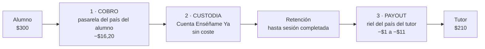
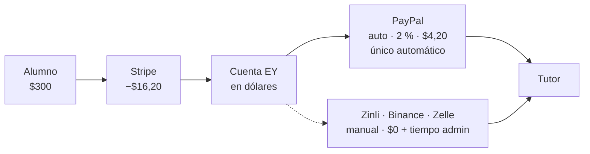
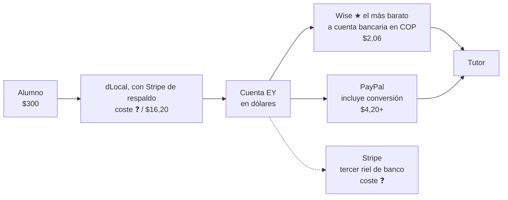
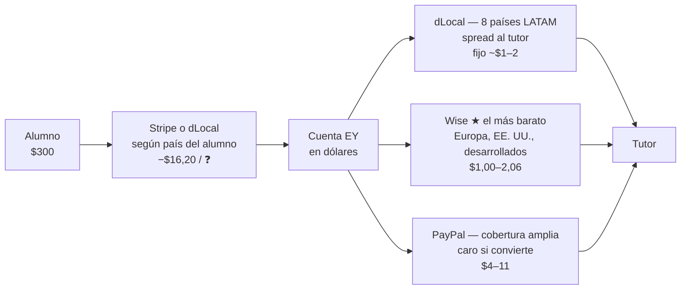

# Enséñame Ya — Pagos y payouts: el coste de cada tramo

> 🔴 **Este documento manda en el COSTE de cada tramo y en quién asume cada comisión. NO manda en el ruteo.**
> Quién cobra, quién paga y qué ve el tutor lo decide **`docs/DICTADO-PAGOS.md`** (9-sep-2026).

> **Qué es esto.** El coste real de cada tramo por el que pasa el dinero, con la marca de si
> está medido o solo publicado. Es el único sitio del repo donde viven esas cifras. Sustituye a
> cualquier comparativa de PSPs anterior, en particular al PDF «Infraestructura de Pagos»
> (Emilio, junio-2026), cuyo eje de análisis es incorrecto (§9).
>
> ⚠️ **Nada de esto está en producción, y es deliberado.** El sitio no está lanzado; todo el
> trabajo de pagos se prueba contra **dev**. Prod tiene el código y las migraciones desplegadas,
> pero no tiene todas las credenciales: hoy le falta `DLOCALGO_API_KEY` y un GET a
> `/api/pagos/confirmar-dlocal` devuelve 503.
>
> Entregable comercial derivado: `EnsenameYa-Pagos-y-Payouts.pdf` (10 págs., versión cliente).
> ⚠️ **Describe el mapa de ruteo anterior**: si se vuelve a enviar, hay que regenerarlo.

**Marcas de confianza usadas en todo el documento:**

| | Significado |
| :-- | :-- |
| ✅ | Verificado contra API viva o contra el código de este repo |
| 📋 | Tarifa pública publicada por el proveedor (confirmar antes de firmar) |
| ❓ | No publicado / pendiente de respuesta del proveedor |

---

## 1 · Lo que este documento no decide

**El ruteo.** Bajo el dictado del 9-sep-2026:

- el **cobro** lo decide el país del **ALUMNO** → `ruta_de_pago(payer_country).charge_providers`;
- el **payout** lo decide el país del **TUTOR** → `ruta_de_pago(payee_country).payout_providers`.

Las dos listas son la misma fila de `payment_routing_rules` leída con clave distinta, están
ordenadas por fee y **se tocan con una migración, nunca con un `UPDATE`** (regla de oro 5). El
mapa país por país está en `docs/DICTADO-PAGOS.md` §2 y §3.

🔴 **Y hay un hueco de ruteo que afecta directamente a las cifras de §7.2: el descenso entre
rieles no existe.** Si el riel elegido **rechaza** la orden, `payouts-process` la marca `failed`
y corta —`src/app/api/cron/payouts-process/route.ts:734`, `case "rechazado"`—: no baja al
siguiente candidato de la lista. El descenso que sí está escrito es el **previo**:
`rielSirveParaEsteTutor` (`src/lib/payments/riel-viable.ts`) aparta los rieles para los que ese
tutor no tiene datos **antes** de elegir. `docs/DICTADO-PAGOS.md` líneas 200-201 dan por escrito
el descenso posterior, y **no lo está**. Para el coste importa porque la elección por fee no
tiene red: un rechazo del riel más barato no se convierte en un pago por el siguiente, se
convierte en un payout que no sale.

### 1.1 · La única pregunta de coste que sigue abierta

**El diferencial de cambio cuando la transferencia la ejecuta una persona.** Si la cuenta del
tutor está en una moneda distinta a la de la orden, la conversión la hace el banco de quien
transfiere, con su propio tipo de cambio. **Quién asume ese diferencial no está decidido**, y por
eso el panel de payouts enseña el importe en la moneda de la orden y no convierte nada
(`src/app/(app)/admin/payouts/page.tsx`). No es un hueco de esquema: es una decisión de negocio
que falta, y hasta que llegue no hay cifra que poner en §7.2 para ese caso.

---

## 2 · Cómo se mueve el dinero



| Paso | Qué ocurre | Coste |
| :-- | :-- | --: |
| 1 · Cobro | El alumno paga la reserva con tarjeta, dentro del sitio | $16,20 |
| 2 · Custodia | El dinero queda retenido hasta que la sesión se completa | $0,00 |
| 3 · Liquidación | Se agrupan las sesiones completadas en una orden de pago | $0,00 |
| 4 · Payout | Se envía por el riel del país del tutor | $1 – $11 |

⚠️ **Automático ≠ instantáneo.** En los rieles automáticos la orden se crea sola, pero el
proveedor tarda de horas a días en confirmar. **`payouts.status = 'paid'` solo se escribe
cuando el proveedor confirma**, nunca al emitir — ver §8 y `20260901120000`.

---

## 3 · El modelo de coste (base de todas las cifras)

- **10 sesiones de $30 = $300 cobrados**
- El tutor se lleva **$210** (split 70/30)
- El alumno paga con **tarjeta internacional LATAM**
- Se cobra y se paga en **USD** salvo donde se indique

⚠️ **El 70/30 es una base de cálculo, no un tier real.** Los tres tiers sembrados en
`20260715170000` dan al tutor **75 %, 85 % o 90 %**, y el de por defecto es el de 75 %. O sea que
el margen del que salen todas las fees de este documento es **más estrecho** que el que suponen
sus cifras: con Tier 1 la comisión bruta es $75, no $90. Ver el techo del descuento en §8.

| Tarifa | Valor | |
| :-- | :-- | :-- |
| Stripe cobro (tarjeta intl.) | 2,9 % + **1,5 % internacional** + $0,30 | 📋 |
| Stripe → banco US | gratis | 📋 |
| ACH banco → PayPal | gratis | 📋 |
| PayPal Checkout (comprador intl.) | 3,49 % + 1,5 % + $0,49 | 📋 |
| PayPal Payouts | 2 % (tope ~$20) | 📋 |
| Wise Business | ~0,4–0,7 % + fijo pequeño, **tipo medio de mercado** | 📋 |
| dLocal Go payout | fijo ~$1–2 **+ spread FX del 4,6–4,7 %** | ✅ |
| dLocal Go cobro | ~4–6 %, negociado por volumen | ❓ |
| Stripe cross-border payouts | no publicado | ❓ |

---

## 4 · Venezuela

**Ningún proveedor bancario internacional llega a Venezuela.** Ni Stripe
(`country_specs/VE` → *«VE is not currently supported»* ✅), ni dLocal, ni Wise, ni
MercadoPago. La solución pasa por **cuentas en dólares**, no por bancos. Es el único país con
pago manual.



| Tramo | Proveedor | Modo | Coste | % s/ $300 |
| :-- | :-- | :-- | --: | --: |
| Cobro (alumno venezolano) | Stripe · tarjeta intl. | auto | $16,20 | 5,40 % |
| Payout único automático | PayPal | auto | $4,20 | 1,40 % |
| Payout casos sueltos | Zinli · Binance · Zelle | manual | $0,00 | 0,00 % |
| **Total, alumno y tutor venezolanos** | | | **$20,40** | **6,80 %** |

**Por qué PayPal sale barato aquí y caro en Europa:** las cuentas venezolanas de PayPal son
en dólares y pagamos en dólares → **no hay conversión**. La conversión es el coste dominante
de todo este documento.

⚠️ **El coste invisible que el tutor asume siempre.** $210 en saldo PayPal **no
valen $210 en Venezuela**: convertir a bolívares pasa por el mercado P2P con un descuento que
ni controlamos ni vemos. Es el argumento principal para **no** cargarle además la comisión del
payout.

### Por qué se descartan los demás canales como automáticos

| Canal | Motivo |
| :-- | :-- |
| **Binance** | 🔴 **Legal.** Enviar USDT desde wallet propia es transmisión de dinero sin licencia (Fla. Stat. §560.103 incluye «virtual currency»; nuestros propios Términos cierran la exención de *agent of the payee*). Además Binance.com no admite entidades US. Stablecoin **solo vía tercero licenciado**, y no hay ninguno en la mesa: Airtm quedó descartada el 3-sep-2026 porque Enséñame Ya es una entidad estadounidense. |
| **Zelle** | Red US-a-US, sin API para negocios. Solo sirve si el tutor tiene cuenta bancaria **propia** en EE. UU. |
| **Zinli** | Producto de consumo, sin API de payouts ni programa de partners. Solo manual. |

⚠️ **En cualquier canal, el titular de la cuenta debe ser el tutor.** Pagar a un tercero
(«págale a mi primo que tiene Zelle») destruye la trazabilidad y es exactamente el patrón que
no puede entrar en el flujo.

---

## 5 · Colombia

Al contrario que Venezuela, **Colombia tiene banca internacional plenamente operativa**.



| Tramo | Proveedor | Modo | Coste | % s/ $300 |
| :-- | :-- | :-- | --: | --: |
| Cobro (alumno colombiano) | dLocal, con Stripe de respaldo | auto | ❓ / $16,20 | ❓ / 5,40 % |
| Payout más barato | Wise a cuenta bancaria | auto | $2,06 | 0,69 % |
| Payout alternativo | PayPal | auto | $4,20+ | 1,40 %+ |
| Payout tercer riel | Stripe | auto | ❓ | — |

⚠️ **Aquí ya no hay «total» de región, y es por el dictado.** Colombia rutea el cobro a dLocal,
cuya tarifa de cobro sigue sin negociar (❓), así que el tramo de cobro solo tiene número si cae
al respaldo de Stripe. El ciclo se suma como en §7.3, una fila de cada tramo.

**dLocal NO cubre Colombia para payouts.** Sus 8 países de payout son AR, BR, CL, EC, MX, PE,
PY, UY. ✅ Colombia cobra por dLocal y **no** puede pagar por dLocal: son dos listas distintas
(§9.1).

---

## 6 · Resto del mundo

La diferencia entre grupos **no es geográfica sino de moneda**.



| Destino del payout | Riel | ¿Convierte moneda? | Coste s/ $210 | % |
| :-- | :-- | :-- | --: | --: |
| **Ecuador** | dLocal | **No — usa dólares** | $1,50 | 0,7 % |
| **España / Europa** | Wise | Sí, a tipo real | $1,55 | 0,7 % |
| **Estados Unidos** | Wise | **No — usa dólares** | ~$1,00 | 0,5 % |
| **AR·BR·CL·MX·PE·PY·UY** | dLocal | **Sí, recargo del 4,7 %** ✅ | fijo ~$1–2 para nosotros; el recargo lo paga el tutor | 0,7 % |
| **España vía PayPal** | PayPal | **Sí, recargo del 3–4 %** | ~$11,00 | 5,2 % |

> 📏 **La única medida real de un payout, hasta hoy (3-sep-2026, sandbox).** Un payout de
> **$15,00 a Ecuador** se ejecutó de punta a punta y dLocal cargó **$15,43 contra el balance, de
> los cuales $0,43 de comisión**. Es el primer y único coste medido, no estimado, del documento.
> ⚠️ **Una sola muestra no distingue comisión fija de porcentual**: $0,43 sobre $15 es un 2,87 %,
> y si fuera porcentual el payout de $210 costaría ~$6 en vez de los ~$1,50 que estima la tabla
> de arriba. Hace falta un segundo payout de importe distinto para saberlo. Hasta entonces, las
> cifras de dLocal de este documento son estimaciones y esta línea es el único dato duro.

### La lección de Ecuador

Mismo proveedor, mismo importe, mismo proceso — **0,7 % en vez de 5,2 %**, solo porque
Ecuador usa dólares. **El coste no lo pone el proveedor: lo pone el cambio de moneda.**
Donde se pueda pagar en dólares, se paga en dólares.

### España

**dLocal no llega y no llegará**: su modelo de negocio son mercados emergentes; en Europa
occidental no hay problema que resolver (existe SEPA). **España → Wise**, ~0,7 %, con Stripe
detrás como tercer riel de banco.

⚠️ Si España va en serio: (a) el tutor cobra en **EUR**, así que hay conversión sí o sí — con
Wise es barata, pero vuelve la pregunta de quién come el diferencial (§1.1); (b) **fiscalidad** —
un autónomo español facturando a una LLC de Florida implica IVA y obligaciones por ambos lados.
No lo resuelve ningún proveedor de pagos.

---

## 7 · Cuadro consolidado, por tramo

**Los dos tramos ya no comparten eje de país**: el cobro lo decide el país del alumno y el payout
el del tutor, así que una tabla por región mezclaría dos preguntas distintas. Van separadas, y un
ciclo se suma tomando una fila de cada una (§7.3).

### 7.1 · Tramo de COBRO — clave: el país del ALUMNO

Base: **$300 cobrados**.

| Pasarela | Dónde cobra | Tarifa | Sobre $300 | |
| :-- | :-- | :-- | --: | :-- |
| **Stripe** | Venezuela y todo país sin fila de dLocal (~176) | 2,9 % + **1,5 % internacional** + $0,30 | **$16,20** | 📋 |
| **dLocal Go** | los 18 países que cobra (§9.1) | ~4–6 %, **negociado por volumen** | **❓** | ❓ |

🔴 **El hueco más grande del documento es esta segunda fila.** El dictado rutea a dLocal el cobro
de 18 países —incluidos los mercados principales— y no sabemos lo que cuesta. Sin esa tarifa no
hay coste del tramo de cobro para la mayoría de las ventas, solo el techo que pone su respaldo
(Stripe, $16,20).

### 7.2 · Tramo de PAYOUT — clave: el país del TUTOR

Base: **$210 al tutor**. La columna de coste es **lo que nos cuesta a nosotros**, que desde la
decisión del spread (§8) no es lo mismo que lo que pierde el tutor.

| Riel | Destino | ¿Convierte? | Nos cuesta | % s/ $210 | El tutor recibe | |
| :-- | :-- | :-- | --: | --: | --: | :-- |
| **Wise** | EE. UU. (USD) | No | ~$1,00 | 0,5 % | $210 | 📋 |
| **Wise** | Europa (EUR) | Sí, tipo medio de mercado | $1,55 | 0,7 % | ~$210 | 📋 |
| **Wise** | Colombia (COP) | Sí, tipo medio de mercado | $2,06 | 1,0 % | ~$210 | 📋 |
| **dLocal Go** | Ecuador (USD) | No | ~$1,50 · **medido $0,43 sobre $15** | 0,7 % | $210 | ✅ |
| **dLocal Go** | AR·BR·CL·MX·PE·PY·UY | Sí, **spread del 4,6–4,7 %** | fijo ~$1–2 | ~0,7 % | **~$199** | ✅ |
| **PayPal** | Venezuela y cuentas en USD | No | $4,20 (2 %, tope ~$20) | 2,0 % | $210 | 📋 |
| **PayPal** | destinos que convierten | Sí, recargo del 3–4 % | ~$11,00 | 5,2 % | $210 | 📋 |
| **Stripe** | tercer riel de banco, detrás de Wise | según destino | **❓ no publicado** | — | ❓ | ❓ |
| **Manual** (Zinli · Binance · Zelle) | solo Venezuela | No | $0,00 **+ tiempo de administración** | 0,00 % | $210 menos el descuento P2P (§4) | ✅ |

### 7.3 · Cómo se suma un ciclo

Una fila de §7.1 **más** una fila de §7.2, y pueden ser de países distintos.

| Ejemplo | Cobro | Payout | Total fees | % s/ $300 | Nos queda |
| :-- | :-- | :-- | --: | --: | --: |
| Alumno España → tutor Ecuador | Stripe $16,20 | dLocal $1,50 | $17,70 | 5,90 % | $72,30 |
| Alumno España → tutor Europa | Stripe $16,20 | Wise $1,55 | $17,75 | 5,92 % | $72,25 |
| Alumno España → tutor Colombia | Stripe $16,20 | Wise $2,06 | $18,26 | 6,09 % | $71,74 |
| Alumno España → tutor Venezuela | Stripe $16,20 | PayPal $4,20 | $20,40 | 6,80 % | $69,60 |
| Alumno Ecuador → tutor Ecuador | dLocal ❓ | dLocal $1,50 | **❓** | — | — |
| Alumno México → tutor México | dLocal ❓ | dLocal ~$1–2 | **❓** | — | — |

Las dos últimas filas son el mercado principal, y están en ❓ por §7.1.

### Las tres conclusiones que mueven dinero

1. **Cobrar cuesta mucho más que pagar.** En el único ciclo con las dos patas con número
   —Stripe cobra, PayPal paga— el **79 %** de lo que se fuga se va en la pasarela de cobro. **El
   recargo por tarjeta internacional de Stripe (+1,5 %) es la línea más cara del documento**:
   $4,50 sobre $300, más que cualquier payout salvo los que convierten moneda. Rutear a los
   alumnos LATAM por dLocal es exactamente lo que hace el dictado; si eso sale más barato o más
   caro **no se puede afirmar** hasta que dLocal dé su tarifa negociada.
2. **Elegir bien el riel de payout es dinero del TUTOR, no nuestro.** Con el spread de dLocal a
   cargo del tutor (§8), pagarle por Wise o por dLocal nos cuesta casi lo mismo —un fijo de $1 a
   $2—; lo que cambia es lo que él recibe: ~$210 por Wise contra **~$199** por dLocal en los
   siete países con moneda local. Son ~$11 por tutor y mes que afectan a la **retención**, no a
   la cuenta de resultados. Que Wise vaya delante de dLocal y de Stripe en la lista de ruteo es
   por esto.
3. **Cadencia del lote:** con comisiones porcentuales (PayPal) agrupar no ahorra nada.
   Solo ahorra en **Wise y dLocal**, que llevan un fijo por operación.

### ⚠️ PayPal Checkout NO ahorra dinero

Se evaluó cobrar por PayPal para que el payout se autofinanciase desde el mismo saldo.
**En fees no ahorra: cuesta 1,2 puntos más** ($24,07 vs $20,40 por ciclo), porque el ACH
banco→PayPal es **gratis** y no había nada que ahorrar en el traslado. El cliente lo descartó el
4-sep-2026: PayPal paga, no cobra.

- Lo que sí aportaría: **demanda desbloqueada** — alumnos venezolanos sin tarjeta
  internacional que hoy no pueden comprar pero sí tienen saldo PayPal. **Es una pregunta de
  negocio, no técnica.**
- **PayPal vía Stripe es imposible**: Stripe solo ofrece PayPal como método de cobro a
  comercios europeos. Sería una integración directa (Orders API), semanas de trabajo.

---

## 8 · Quién asume cada comisión

✅ **Hoy, por código, Enséñame Ya asume el 100 %.** No es una política escrita: es lo que
hace `create_booking_line` — el neto del tutor se calcula sobre el **bruto que pagó el
alumno**, antes de que ningún proveedor descuente nada.

```sql
v_net := round(v_total * v_split / 100.0);   -- lo del tutor
v_fee := v_total - v_net;                     -- lo nuestro
```

Da igual lo que cobre el procesador: **el número del tutor no se mueve** y toda la comisión
sale de la nuestra.

| Concepto | Importe | Lo asume hoy | ¿Trasladable al tutor? |
| :-- | --: | :-- | :-- |
| Comisión de cobro | $16,20 (Stripe) · ❓ (dLocal) | **Enséñame Ya** | ❌ Se descuenta antes de llegar; exigiría cambiar el split congelado por reserva |
| Traslado entre cuentas propias | $0,00 | — | No aplica |
| Comisión de payout | $1 – $4 | **Enséñame Ya** | ✅ Técnicamente sí. **Recomendamos no hacerlo** |
| Spread FX de dLocal | ~$11 s/ $210 | ✅ **Tutor** (decisión del cliente, 2-sep-2026) | Decidido. Ver abajo |
| Conversión a moneda local | variable | **Tutor** | Fuera de nuestro control |
| Diferencial de una transferencia hecha a mano | variable | **sin decidir** | Pregunta abierta (§1.1) |

### ✅ La decisión del spread — tomada el 2-sep-2026

En los 7 países de dLocal con moneda local, la API **obliga a fijar o lo que recibe el tutor
o lo que pagamos nosotros — nunca las dos**. `POST /v1/payouts` no tiene moneda de origen:
`transfer_amount` va siempre en la del beneficiario (verificado — mandar `transfer_currency`
devuelve 200 y **se ignora en silencio**). Así que no hay tercera opción, y no elegir también
elige.

**Decisión del cliente: lo asume el TUTOR.** Fijamos lo que sale de nuestro balance
(`payouts.amount` en USD) y el tutor recibe el equivalente en su moneda.

⚠️ **Cómo está implementado, porque tiene un techo que hay que conocer.** La tasa a la que
dLocal *liquida* no es la que publica —sale un 4,6–4,7 % peor, medido— y **no existe en ningún
endpoint**: solo se puede leer después, comparando `amount` con `balance_total_amount` del
payout ya hecho. Convertir con la tasa publicada equivaldría a fijar lo que recibe el tutor y
comernos el spread, que es lo contrario de lo decidido. Por eso se aplica un **factor de
corrección medido** (`DLOCALGO_FX_SPREAD`, 4,7 % por defecto, movible sin desplegar).

El factor es una **media, no la tasa de cada operación**: cada pago se desvía lo que se desvíe
el factor. Se recalibra con datos propios — el rastro de cada payout archiva la tasa publicada,
el factor aplicado, la efectiva y el importe, y con el cargo real del GET el factor de esa
operación es una división.

**Consecuencia en pantalla:** el importe en moneda local del tutor es **aproximado** y hay que
decírselo. En **Ecuador no**: cobra en USD y no hay conversión.

### El techo aritmético de un descuento

Si la plataforma **absorbe** el descuento de una promoción, el descuento máximo sin perder
dinero es **su propia comisión**, porque el tutor cobra lo mismo con promoción que sin ella.

| Tier | Se lleva el tutor | Comisión | Descuento máximo absorbible |
| :-- | --: | --: | --: |
| Tier 1 (por defecto) | 75 % | 25 % | **25 %** |
| Tier 2 | 85 % | 15 % | **15 %** |
| Tier 3 | 90 % | 10 % | **10 %** |

Los tres valores son los sembrados en `20260715170000`. ✅

**El caso que hay que saber antes de prometer un porcentaje:** con un tutor de **Tier 2 (85 %)**,
un descuento del **20 %** sobre una mentoría de **$100** deja a la plataforma **poniendo $5 de su
bolsillo** en cada reserva — el alumno paga $80 y el tutor sigue cobrando sus $85. **Es
sostenible solo si se decide a propósito.**

⚠️ **Y el techo de la tabla es antes de fees.** Esa misma comisión paga también el cobro y el
payout (§7), así que el descuento que de verdad no cuesta dinero es la comisión **menos** lo de
§7.3: sobre $100 y con Tier 2, no son $15 sino ~$9.

**Mecánica, el día que se construya:** el descuento sale de `payments.platform_fee_amount` y
**`payments.tutor_net_amount` no se toca**, así que no hay que abrir el reparto de
`create_booking` —la parte que congela el snapshot financiero (regla de oro 7)—. Hoy **no
existe**: ni el esquema ni el checkout tienen código de promoción ni columna de descuento. ✅

### Recomendación

| Concepto | Recomendación | Por qué |
| :-- | :-- | :-- |
| **Cobro** | Lo asume Enséñame Ya | Cargarlo al alumno es un recargo visible en el checkout que reduce conversión |
| **Payout** | Lo asume Enséñame Ya | $1–$4/mes no compensa ni la conversación ni el desarrollo. En VE el tutor ya come el descuento invisible del P2P |
| **Spread dLocal** | Lo asume el tutor | Decisión del cliente del 2-sep-2026, así implementado. La recomendación técnica era la contraria —que lo asumiéramos nosotros, por coherencia con los otros dos— y se deja escrita para que la decisión se pueda revisar con su contexto |

---

## 9 · Estado de verificación

### ✅ Verificado (contra API viva o contra este repo)

- `country_specs/VE` → «VE is not currently supported». Venezuela fuera de Stripe.
- dLocal Go **sí** paga a terceros: `POST /v1/payouts`, flujo B2C, **8 países**
  (AR, BR, CL, EC, MX, PE, PY, UY). **Sin VE ni CO.**
- **dLocal y Stripe solo pagan con el dinero que ellos cobraron**; PayPal y Wise se fondean
  desde nuestro banco y no están atados a nadie (`ataduraDeBalance` en `lib/payments.ts`).
- Spread FX de dLocal: **4,6–4,7 % peor** que la tasa de su propio `/v1/currency-exchanges`.
  Aplica en **7 de los 8** países (Ecuador no, usa USD).
- `create_booking_line`: el neto del tutor se calcula sobre el bruto → **EY asume las fees**.
- Los tres tiers de `tutor_tiers` son **75 / 85 / 90** para el tutor, con el de 75 % por defecto.
- `payout_country_rules` / `payout_banks` son catálogos con PK por país → **añadir un país es
  datos, no migración de esquema** (así entraron 44 países de golpe en `20260910150000`).
- `tutor_payout_accounts` ya guarda nombre, documento fiscal, banco, cuenta, tipo de cuenta,
  dirección y teléfono → cubre a Wise, a dLocal y a Stripe sin cambio de esquema.

### 9.1 · La cobertura de cobro de dLocal, medida (4-sep-2026)

`POST /v1/payments` del sandbox, 47 países, importe de $30 en USD. **No es su documentación:
es su API contestando.** ✅

| | Países |
| :-- | :-- |
| **Cobra (200)** — 18 | AR · BO · BR · CL · CO · CR · DO · EC · GT · MX · PA · PE · PY · UY · **ID · KE · MY · NG** |
| **No cobra (400 `5000`)** | **VE** · SV · NI · HN · JM · TT · toda Europa · el resto de Asia y África |
| **Conoce el país pero no ofrece con qué pagar (400 `5010`)** | US · ES · PH |
| **Paga (payouts)** — solo 8 | AR · BR · CL · EC · MX · PE · PY · UY |

⚠️ **Cobrar y pagar no son la misma lista, y la diferencia son diez países.** En BO, CO, CR,
DO, GT, PA, ID, KE, MY y NG dLocal cobra y **no** paga. No es un problema de coste: PayPal y Wise
se fondean desde nuestro banco, así que ahí el payout sale por otro riel sin depender del balance
de quien cobró. La atadura solo aplica a dLocal y Stripe entre sí.

⚠️ **Venezuela no la cubre dLocal ni para cobrar ni para pagar.** Es el único país al que no
llega ninguno de los tres rieles bancarios, y por eso es el único con pago manual.

### 9.2 · Cobertura de cada riel

Vive en **`docs/DICTADO-PAGOS.md` §3**, «Dónde llega cada riel — medido el 9-sep-2026». Qué país
alcanza cada proveedor es ruteo, no coste; aquí solo se paga lo que cuesta llegar (§7.2).

### 9.3 · Qué se ha ejercitado DE PUNTA A PUNTA

> **Qué cuenta como «de punta a punta» aquí:** que lo haya movido **nuestro código** —el
> checkout, el adaptador, el job— y que el **proveedor lo confirme** después con su propio
> identificador. Llamar a la API con un script NO cuenta: prueba el riel, no la integración.

| Camino | Estado | La prueba |
| :-- | :-- | :-- |
| **Stripe · cobro** | ✅ | 33 pagos con `pi_…`; Session → webhook firmado → reserva |
| **Stripe · reembolso** | ✅ | 2 ejecutados (30-ago, $47,50) |
| **Stripe · payout** | ✅ | Job → adaptador → `tr_1UByB3HLJB7CRIwf7DyCA2OK`, $16,50 a EC. Segunda pasada: `enviados: 0`, sigue habiendo **una** transferencia. Entra como tercer riel de banco, detrás de Wise (D-1, aprobada el 10-sep-2026) |
| **dLocal · cobro** | ✅ | Compra por la interfaz → `DP-253836`, $45,00 → webhook → pago `paid`, reserva `confirmed` |
| **dLocal · reembolso** | ✅ | Cancelación a >24 h → cola → job → **`REF-1991` `SUCCESS`** en dLocal, $45,00 (RN-37 al 100 %) |
| **dLocal · payout** | ✅ | `73128925947501`, $15,00, `paid` — y el **único coste medido** del documento: $0,43 de comisión |
| **PayPal · payout** | ✅ | Recorrido entero con dinero moviéndose: el tutor conecta su cuenta → retira → job → lote `DRM7SBVWEX65G` → **`item: SUCCESS`** → segunda pasada → fila **`paid`** y NTF-12 encolado. Repetido dos veces (`4U4DQPGVPL3NS`). El camino de recuperación también está ejercitado (§9.4) |
| **PayPal · cobro** | — | No se integra: decisión del cliente del 4-sep-2026 |
| **Wise · payout** | 🟡 **a medias** | Adaptador escrito y su mapeo comprobado (`npm run check:wise`), pero **el dinero no se ha movido**: presupuesto, alta de destinatario y creación de la transferencia funcionan y el **fondeo** falla si la cuenta no tiene saldo. No es un límite del diseño: operaciones fondea las cuentas a diario antes del ciclo de payouts (`docs/DICTADO-PAGOS.md` §3), y el adaptador aguanta la espera —la transferencia se queda en `incoming_payment_waiting` y el job reintenta |

🔴 **El aviso que sale de haber hecho esto: `payments.provider` puede mentir.** Cuatro filas
decían `provider = 'dlocal'` llevando identificadores `pi_…` —de Stripe— y fechadas tres semanas
antes de que existiera el adaptador de dLocal: eran filas de semilla reetiquetadas. **El
identificador es el que no miente**, y cualquier cifra de coste sacada de agrupar por `provider`
hay que cotejarla con la forma del `provider_payment_id`.

⚠️ **El único tramo que no es real es el transporte del webhook de dLocal**, y solo porque
`localhost` no es alcanzable desde fuera: se le hace la llamada al endpoint local con su firma.
No cambia nada de lo que se prueba — **nuestro webhook no se cree el cuerpo que recibe**, le
repregunta el estado a `GET /v1/payments/{id}`, así que la verdad la sigue diciendo dLocal.

### 9.4 · PayPal: por qué se paga a la cuenta conectada y no al correo

El tutor conecta su cuenta con «Log in with PayPal», nos quedamos con su identificador, y el pago
entra. El **camino del correo sigue existiendo** como respaldo para quien no conecte su cuenta, y
ahí el fallo de abajo se puede repetir.

| Cómo se manda | Resultado |
| :-- | :-- |
| Al correo que teclea el tutor | `UNCLAIMED` · **5 de 5** |
| Al identificador de la cuenta conectada | `SUCCESS` · **3 de 3** |

#### Lo que falla cuando se paga a un correo (medido dos veces)

Un payout de PayPal por correo **no llega solo**. El destinatario tiene que reclamarlo, y hasta
que lo haga el dinero se queda retenido —30 días— y luego vuelve. Los dos modos de fallo, los
dos medidos, y **en los dos el lote informa `SUCCESS`**:

| Motivo | Qué significa | Medido |
| :-- | :-- | :-- |
| `RECEIVER_UNREGISTERED` | El correo no tiene cuenta de PayPal | 3-sep, lote `FR6E6SEVN4A5E` |
| `RECEIVER_UNCONFIRMED` | La cuenta existe **y está verificada**, pero ese correo no está confirmado en ella | 4-sep, lote `VXMFYXXG3RY56` |

⚠️ **«Verificada» y «correo confirmado» no son lo mismo**, y la segunda es la que manda: la
cuenta de sandbox `sb-dnutt…@personal.example.com` figura como *Verified* en el panel de PayPal
y su payout sigue `UNCLAIMED`.

**La prueba que lo separa todo (4-sep, misma cuenta, con minutos de diferencia):**

| Cómo se manda | Destino | Resultado |
| :-- | :-- | :-- |
| `recipient_type: PAYPAL_ID` | `BEWSZFK8MDBWU` | ✅ **item `SUCCESS`**, $1,00 **entregado** |
| `recipient_type: EMAIL` | `sb-dnutt…@personal.example.com` | ⚠️ item `UNCLAIMED`, `RECEIVER_UNCONFIRMED` |

O sea que **el riel entrega** —no es un problema de nuestra integración, ni de la cuenta, ni
del país— y lo que falla es **la entrega por correo a una dirección sin confirmar**.

**Consecuencia para el producto, que no está especificada en ningún sitio:** al tutor hay que
**decirle que tiene un pago esperando y que entre en PayPal a reclamarlo**. Sin eso, un tutor
que registró un correo sin cuenta —o con el correo sin confirmar— ve «pago enviado» y no cobra
en 30 días. **Hoy no hay aviso para eso.**

✅ **Lo que el sistema sí hace bien:** la fila se queda en `processing` y **nunca** pasa a
`paid`, así que NTF-12 («se pagó tu liquidación») no se dispara. Es la regla del puerto
—`enviado` ≠ `pagado`— haciendo su trabajo.

⚠️ **No se cambia el adaptador a `PAYPAL_ID`, y es deliberado.** Un tutor sabe su correo; su id
de cuenta de PayPal no lo sabe nadie y no se le puede pedir. `EMAIL` es lo correcto para el
producto. Lo que hay que arreglar no es cómo se manda, es **avisar al tutor cuando su pago
queda esperando**.

**Y el camino de recuperación, ejercitado entero (4-sep):**

| Paso | Resultado |
| :-- | :-- |
| Se cancela el item no reclamado en PayPal | `UNCLAIMED` → `RETURNED`, el dinero vuelve |
| Pasada del job | lo clasifica **`difunto` solo**: fila a `scheduled`, `provider_payout_id` borrado, `intento` a **2** y el lote muerto archivado en `intentos_muertos` |
| Pasada siguiente | crea un lote **nuevo** con la marca del intento 2 (`VXMFYXXG3RY56`), al destino corregido |

Eso cierra el bucle silencioso que documenta `PayoutResult.difunto`: sin `intento`, el barrido
del segundo intento encontraría el cadáver del primero y lo daría por bueno para siempre.

### ❓ Lo que falta para cerrar el coste

| Qué | Con quién | Por qué importa |
| :-- | :-- | :-- |
| **Comisión de cobro negociada** | **dLocal** | Es el hueco de §7.1. Sin ella no hay coste del tramo de cobro en los 18 países que el dictado rutea a dLocal, o sea en el mercado principal |
| **¿El payout de dLocal es fijo o porcentual?** | medición propia | Una sola muestra ($0,43 sobre $15) no lo distingue. Un segundo payout de importe distinto lo resuelve sin preguntar a nadie |
| **Tarifa real de PayPal Payouts** | **PayPal** | Varía por cuenta y país; el 2 % es el público |
| **Coste de un payout de Stripe** | **Stripe** | Sus cross-border payouts no están publicados, y Stripe ya paga como tercer riel de banco |
| **Quién asume el diferencial de una transferencia hecha a mano** | cliente | §1.1 |

⚠️ **El modo de fallo de PayPal es el peor de la lista:** que acepte los primeros lotes y
después congele la cuenta con dinero de tutores dentro. Por eso la prueba de sandbox va
**antes** de cualquier trabajo de PayPal — **es la misma cuenta**.

### 🔴 Comparativas anteriores que no sirven

- **El eje del PDF «Infraestructura de Pagos» (Emilio, jun-2026) está mal.** Razona por «¿en qué
  país ocurre la transacción?». Los ejes reales son dos: el país del **alumno** decide quién
  cobra y el del **tutor** quién paga. «Stripe en LATAM son solo BR y MX» es cierto para
  **cobrar** y falso para **pagar**.
- **MercadoPago Split** exige CUIT/RFC/CNPJ. Una LLC de Florida no los tiene. Inviable.
- **Airtm** era el payout recomendado de Venezuela en las versiones anteriores de este análisis.
  Descartada el 3-sep-2026: Enséñame Ya es una entidad estadounidense.

---

## 10 · Orden de trabajo

Vive en **`docs/DICTADO-PAGOS.md` §8**. Qué se construye y en qué orden es ruteo y producto, no
coste. Lo que este documento pide para completarse está en «❓ Lo que falta para cerrar el coste».

---

## Relacionado

- `docs/DICTADO-PAGOS.md` — 🔴 manda en el ruteo: quién cobra, quién paga y qué ve el tutor
- `docs/DICTADO-PAGOS.md` §8 — lo que ya se probó con dinero real
- `docs/BACKLOG.md` §EP-10 — épica de payouts
- `docs/PLAN-DESARROLLO.md` — estado de ejecución
- `CLAUDE.md` §«Integraciones» y §«Reglas de oro» (2, 5 y 9)
- Migraciones clave: `20260716140000` (payouts), `20260715170000` (tiers y split),
  `20260901120000` (el payout deja de mentir), `20260901130000` (por moneda y proveedor)
- `src/lib/payments/port.ts` — el puerto, con `PayoutResult` y su taxonomía de desenlaces
