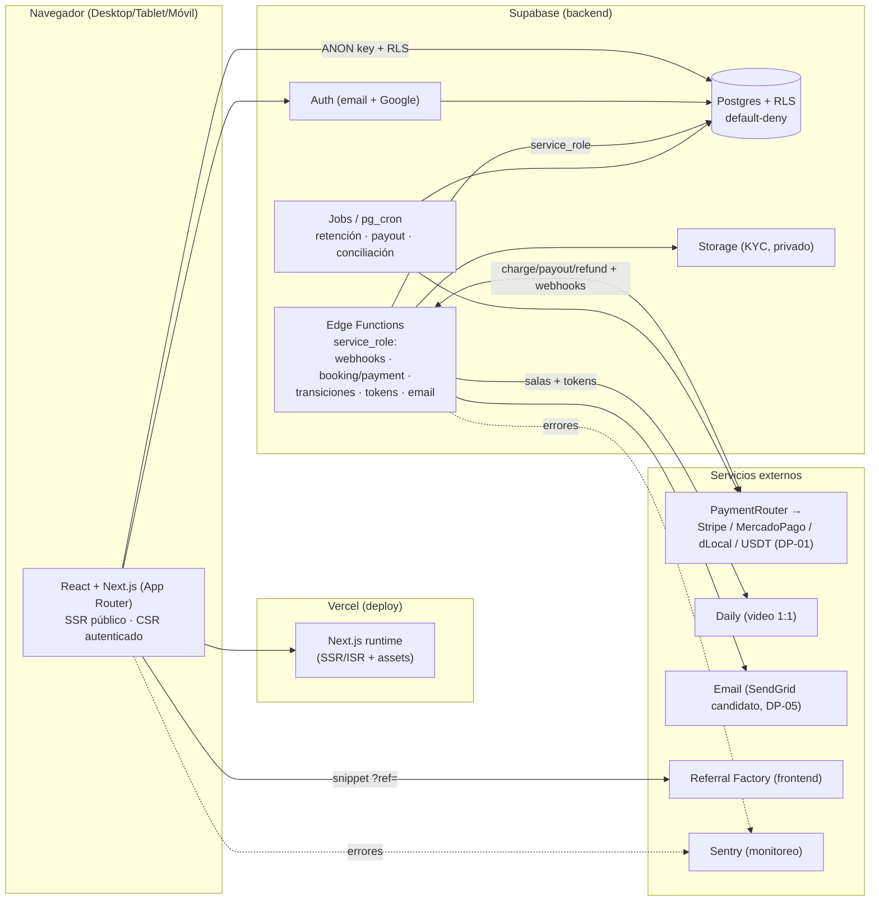

# REVISIÓN — Coherencia de Docs 1, 2 y 3 (y derivados)

> **Enséñame Ya — MVP Web.** Auditoría de consistencia cruzada de los Documentos 1 (Modelo de Datos), 2 (Máquinas de Estado) y 3 (Roles y Permisos/RLS) contra el conjunto completo de documentos de contexto (Doc 0–9).

| Campo | Valor |
| :-- | :-- |
| **Documento** | REVISIÓN — Docs 1–3 |
| **Proyecto** | Enséñame Ya — MVP Web |
| **Alcance** | Docs 1, 2, 3 + sus derivados/consumidores (Docs 4, 5, 6, 7, 8, 9) |
| **Base de verdad conceptual** | Doc 0 (manda en lo conceptual) |
| **Estado** | Hallazgos para revisión del cliente/equipo |
| **Fecha** | 2026-06-06 |

---

## Veredicto general

El conjunto está **muy bien alineado**. Verificaciones globales que pasan:

- Los `enum` del Doc 1 §1.3 calzan **valor por valor** con las 8 máquinas del Doc 2 (M1–M8), incluidos estados iniciales/terminales del inventario §2.3.
- Numeración **continua y sin colisiones**: `RN-01..RN-36`, `S-01..S-53`, `DP-01..DP-08`. El Doc 9 §9.4 declara exactamente `S-01..S-53`. ✔
- Las 16 notificaciones del Doc 7 mapean a transiciones reales del Doc 2 (Doc 7 §7.4). ✔
- Cálculo y "congelado" del split (S-08/RN-08) consistente entre Doc 1 §1.4.12, Doc 6 §6.6 y RN-08. ✔
- Escritura financiera solo `service_role` (S-15/RN-26) alineada en Doc 1 §1.6, Doc 3 §3.4 y Doc 6 §6.1. ✔
- Nomenclatura `payer`=alumno / `payee`=tutor uniforme en `profiles`/`bookings`/`payments`/`payment_routing_rules` y en `ChargeInput` (Doc 6). ✔
- `payout_items` como puente que soporta DP-06 sin migración: coherente en Doc 1 §1.4.14, Doc 2 §2.14 y Doc 6 §6.7. ✔

Los hallazgos abajo no invalidan el diseño; son ajustes de coherencia y dos decisiones de diseño que conviene cerrar.

> **Nota de estado:** Doc 1 figura como **"Aprobado"** mientras Doc 2 y 3 están en **"Borrador para revisión"**. Los hallazgos H-1, H-5, H-6 y H-7 tocan el esquema del Doc 1; aceptarlos implica reabrir mínimamente ese documento aprobado.

---

## 🔴 Sustantivos (lógica / diseño — requieren decisión)

### H-1 · Ancla de retención del payout incoherente para paquetes
- **Dónde:** Doc 2 §2.14 (línea 340) y RN-30 (línea 359) anclan el **inicio de retención al `paid` del pago**. La guarda de M7 `pending→scheduled` (§2.10, línea 261) exige **solo** "fin de retención (DP-02)", **sin** exigir que la reserva esté `completed`.
- **Problema:** para una **sesión única** coincide, pero para un **paquete** (p. ej. 10 sesiones semanales) con retención de 15 días, el payout se programaría/pagaría con el servicio **aún sin entregar** — al revés del orden del camino feliz §2.12 (paso 6 después del paso 5 "última sesión completada", líneas 303–311).
- **Choque adicional:** M4 `→completed` (§2.7, línea 170) dice "consolida neto del tutor para payout (M7)", sugiriendo que la consolidación es **al completar**; M6 `→paid` (§2.9, línea 230) dice "crea `payout_item` y devenga payout". El verbo "consolida" vs "devenga" es ambiguo y podría leerse como doble creación del item.
- **Recomendación:** mantener el devengo del `payout_item` al `paid` (RN-30, está bien), pero **condicionar la transición `pending→scheduled` a `booking.status = completed` *y* fin de retención**. Precisar la redacción de §2.7 para que "consolida" signifique "finaliza el monto tras posibles ajustes", no "crea".

### H-2 · `bookings` con `C` directo al alumno, pero la fila lleva snapshots financieros que el alumno no debe (ni puede) fijar
- **Dónde:** Doc 3 §3.4 da al alumno `C/R (o)` sobre `bookings` (línea 87); Doc 1 §1.4.10 dice "el alumno lee/crea las suyas" (línea 217). La reserva incluye `tier_split_pct`, `subtotal_amount`, `total_amount`, `payer/payee_country` como **snapshots** (Doc 1 §1.4.10, líneas 209–213).
- **Problema:** el alumno **no tiene lectura sobre `tutor_tiers`** (Doc 3 §3.4, línea 80), por lo que no puede calcular el split; y leída literal, la matriz permitiría a un cliente insertar montos/split arbitrarios. En contraste, el `payment` lo crea **service_role** (Doc 3 línea 89; Doc 6 §6.6 línea 124), dejando una asimetría: pago server-mediated vs reserva cliente-side.
- **Recomendación:** declarar explícitamente que la **creación de `booking` va por función controlada/Edge Function** (igual que los cambios de estado, Doc 2 §2.2 línea 45), que computa los snapshots server-side; o restringir el `C` del alumno a un subconjunto de columnas con trigger que rellene los campos financieros.

---

## 🟡 Medios (consistencia entre documentos)

### H-3 · La matriz §3.8 (autorizadores de transición) está incompleta vs Doc 2
- **Dónde:** Doc 3 §3.8 (líneas 196–211) omite:
  - M4 `→completed` (sistema) y `→refunded` (webhook/admin) — presentes en Doc 2 §2.7 (líneas 170–172).
  - M5 `→no_show` (sistema) — presente en Doc 2 §2.8 (línea 204).
- **Recomendación:** agregar esas filas para que §3.8 sea exhaustiva respecto a Doc 2.

### H-4 · La tabla `notifications` no aparece en la matriz maestra del Doc 3
- **Dónde:** se define recién en Doc 7 §7.5 (líneas 79–101) con su propia RLS (escritura `service_role`, lectura del usuario sobre lo suyo). La matriz §3.4 (Doc 3, líneas 76–94) lista 17 tablas y **no** la incluye, aunque Doc 1 §1.4.17 (línea 341) la dejó "referenciada" y el backlog la trata como financiera-equivalente (US-1402, Doc 8 línea 172).
- **Recomendación:** nota-puente en §3.4 que remita a Doc 7 §7.5, para que la RLS de `notifications` no quede fuera de la fuente de verdad de permisos.

### H-5 · `availability_exceptions` permite `U` pero no tiene `updated_at`
- **Dónde:** la matriz da `C/R/U/D (o)` al tutor (Doc 3 línea 86) y Doc 5 §5.5 SCR-TU05 habla de "CRUD … excepciones" (línea 220), pero la tabla solo tiene `created_at` (Doc 1 §1.4.9, línea 192), contra la convención de auditoría que pide `updated_at` en "toda tabla mutable" (Doc 1 §1.2, línea 30).
- **Recomendación:** agregar `updated_at`, o declarar las excepciones inmutables (editar = borrar+crear) y quitar la `U`.

### H-6 · `tutor_tiers.is_default` sin restricción de unicidad
- **Dónde:** Doc 5 §5.7 SCR-AD12 valida "un solo `is_default`" (línea 310) y M1 asigna "tier por defecto" al aprobar (Doc 2 §2.4, línea 81), pero el modelo (Doc 1 §1.4.3, línea 97) no impone un único default; podrían existir dos y la asignación en M1 sería ambigua.
- **Recomendación:** `CREATE UNIQUE INDEX ... ON tutor_tiers (is_default) WHERE is_default`.

### H-7 · `user_roles` sin PK declarada
- **Dónde:** Doc 1 §1.4.2 (líneas 79–86) define `UNIQUE(user_id, role)` pero ninguna PK. La convención exime de PK uuid a "puente/1:1" (Doc 1 §1.2, línea 29) — encaja, pero conviene formalizar.
- **Recomendación:** declarar `PRIMARY KEY(user_id, role)` explícito para claridad y FKs.

### H-13 · La arquitectura de aplicación (frontend / runtime / despliegue) no está declarada en ningún documento
- **Dónde:** los Docs 0–9 especifican con detalle **dominio, datos, estados, RLS, pagos e integraciones**, pero **ninguno declara el stack de aplicación concreto**: el framework de frontend, dónde corren los webhooks/jobs ni el modelo de despliegue/ambientes. Las únicas anclas son indirectas: propuesta §8 ("web-first", "separación clara entre interfaz y backend", ambientes dev/prueba/prod), §17 (Vercel, Supabase, SendGrid, Sentry, Daily) y §11 (staging + producción); más referencias dispersas en Doc 6 ("Edge Function, service_role" §6.8; variables `SUPABASE_*` §6.15; Auth Supabase §6.10) y Doc 0 (RLS de Supabase, RN-19).
- **Problema:** un dev full-stack (y el **RISK-18**, bus factor = 1) no tiene una fuente única que fije **React + framework**, el runtime de la lógica financiera ni el mapa de ambientes. Esto termina decidiéndose implícitamente al codificar, con riesgo de incoherencia — p. ej. **dónde se crea el `booking`**, que es justamente el problema de **H-2** (cliente vs. función controlada server-side).
- **Recomendación:** declarar la arquitectura de forma explícita. Ver **Anexo A** (abajo): **React + Next.js (App Router) sobre Vercel**, con **Supabase** como backend (Postgres+RLS, Auth, Storage, Edge Functions) y la **lógica de dinero en Edge Functions `service_role`**. Las pocas opciones realmente abiertas se aíslan en A.6 (AD-01…AD-03) para no inventar decisiones.

---

## 🟢 Menores (redacción / derivados)

### H-8 · Fórmula de slots ignora las excepciones `open`
- **Dónde:** Doc 5 §5.4 SCR-AL04 (línea 155) describe la disponibilidad como "`availability_rules − availability_exceptions − sesiones ocupadas`", pero el tipo `open` (Doc 1 §1.4.9, línea 189) **suma** disponibilidad.
- **Recomendación:** redactar como "reglas **+ excepciones `open` −** excepciones `block` − sesiones ocupadas".

### H-9 · `payouts` no guarda snapshot de corredor / `payee_country`
- **Dónde:** `payments` sí lo snapshotea (Doc 1 §1.4.12, línea 250); el payout resuelve proveedor por `payee_country` (Doc 6 §6.7, línea 149) pero lo deriva del tutor. Si el tutor cambia su `payout_country`, se pierde trazabilidad histórica del payout.
- **Recomendación:** considerar snapshot de `payee_country`/corredor en `payouts`.

### H-10 · `categories` con `D` físico pese a tener `is_active`
- **Dónde:** la matriz permite `D` a admin (Doc 3 §3.4, línea 83); borrar una categoría con `product_categories` asociadas dejaría huérfanos. Contrasta con la preferencia por baja lógica (Doc 1 §1.2, línea 35).
- **Recomendación:** preferir `is_active=false` para categorías con productos; reservar `D` a categorías sin uso.

### H-11 · Doc 4 usa nombres en prosa de NTF; Doc 5/7 usan códigos `NTF-xx`
- **Dónde:** Doc 4 §4.4 (líneas 132–144) escribe "NTF recibo", "NTF reserva confirmada", etc., mientras el catálogo formal está en Doc 7 §7.3 (líneas 42–59) y Doc 5 ya usa códigos.
- **Recomendación:** unificar Doc 4 a los códigos `NTF-xx` para trazabilidad.

### H-12 · Redacción §2.1 ("8 máquinas correspondientes a los `enum`")
- **Dónde:** Doc 2 §2.1 (línea 27): Doc 1 tiene 11 `enum`; solo 9 con ciclo de vida (8 máquinas + `availability_exception_type` que no es máquina). Los no-máquina son `user_role`, `pricing_model`, `availability_exception_type`.
- **Recomendación:** precisar "a los `enum` **con ciclo de vida**".

---

## Resumen de hallazgos

| ID | Sev. | Tema | Docs afectados |
| :-- | :-- | :-- | :-- |
| H-1 | 🔴 | Retención de payout antes de completar el servicio (paquetes) | 2 (§2.7/§2.10/§2.14), 6 |
| H-2 | 🔴 | `bookings.C` del alumno con snapshots financieros | 1 (§1.4.10), 3 (§3.4), 6 |
| H-3 | 🟡 | §3.8 omite transiciones M4 completed/refunded y M5 no_show | 3 (§3.8), 2 |
| H-4 | 🟡 | `notifications` ausente en matriz §3.4 | 3 (§3.4), 7 (§7.5), 1 |
| H-5 | 🟡 | `availability_exceptions` con `U` sin `updated_at` | 1 (§1.4.9), 3, 5 |
| H-6 | 🟡 | `tutor_tiers.is_default` sin unicidad | 1 (§1.4.3), 2, 5 |
| H-7 | 🟡 | `user_roles` sin PK | 1 (§1.4.2) |
| H-13 | 🟡 | Arquitectura de app (React / runtime / despliegue) no declarada en ningún doc | 0–9, propuesta §8/§17 → **Anexo A** |
| H-8 | 🟢 | Fórmula de slots ignora `open` | 5 (§5.4), 1 |
| H-9 | 🟢 | `payouts` sin snapshot de corredor | 1 (§1.4.13), 6 |
| H-10 | 🟢 | `categories` con `D` físico | 3 (§3.4), 1 |
| H-11 | 🟢 | Doc 4 usa prosa en vez de códigos NTF | 4, 7 |
| H-12 | 🟢 | Redacción "8 máquinas / 11 enum" | 2 (§2.1) |

---

## Anexo A — Arquitectura del proyecto (declaración explícita)

> **Por qué este anexo.** Cubre el vacío detectado en **H-13**: ningún documento 0–9 declara la arquitectura de aplicación concreta. Aquí se hace **explícita** y se **ancla** a lo que ya fijan la propuesta firmada y el Doc 6, sin contradecir ningún `DP`. Las decisiones realmente abiertas se aíslan en **A.6** (AD-01…AD-03) — no se inventan.
>
> **En una frase:** **app web React (Next.js, App Router) desplegada en Vercel, con Supabase como backend (Postgres+RLS, Auth, Storage y Edge Functions), pagos/payouts detrás de una capa agnóstica de adaptadores, y la escritura financiera siempre server-side con `service_role`.**

### A.1 Stack por capa (y su ancla en los docs)

| Capa | Elección declarada | Ancla / fuente |
| :-- | :-- | :-- |
| **Frontend web** | **React + Next.js (App Router), TypeScript** | Propuesta §8 (web-first, separación interfaz/backend), §12.1 (páginas públicas con SEO); SPA alterna en **AD-01** |
| **Hosting / deploy** | **Vercel** (preview por PR + producción) | Propuesta §17 (Vercel Pro), §11 (staging + producción) |
| **Estilos / responsive** | Utilitario (recomendación Tailwind) + diseño responsive D/T/M | Propuesta §8/§12; checklist responsive §11 — concreta en **AD-03** |
| **Backend (BaaS)** | **Supabase**: Postgres + **RLS**, Auth, Storage, Edge Functions | Doc 0 RN-19; Doc 3 (RLS); Doc 6 §6.10/§6.15; S-10/S-19 (Storage) |
| **Lógica server-side / dinero** | **Edge Functions `service_role`** (webhooks, creación de booking/payment, transiciones de estado) | Doc 6 §6.6/§6.8; S-15/RN-26; Doc 2 §2.2; resuelve **H-2** |
| **Jobs programados** | Retención/agendado de payout, conciliación (`pg_cron` o scheduler) | Doc 6 §6.7/§6.8 (M7); runtime en **AD-02** |
| **Pagos / payouts** | Capa *ports & adapters*: `PaymentRouter` + `PaymentProvider` | Doc 6 §6.2; routing en BD (RN-15/16); proveedores = `DP-01` |
| **Video 1:1** | **Daily** (sala por sesión, token server-side) | Doc 6 §6.9; RN-18/S-07/S-45 |
| **Email transaccional** | Puerto `EmailProvider` (SendGrid candidato) | Doc 6 §6.11; `DP-05` |
| **Referidos** | **Referral Factory**, integrado **en frontend** (sin lógica interna) | Doc 6 §6.12; RN-21; `DP-04` |
| **Monitoreo** | **Sentry** (frontend + Edge Functions) | Doc 6 §6.13; S-09 |
| **Ambientes** | dev / staging (preview) / producción | Propuesta §8/§11 |

### A.2 Frontend (React / Next.js)

- **Por qué Next.js y no una SPA pura:** el catálogo de pantallas exige **SEO** en lo público (Doc/propuesta §12.1: landing, "explorar tutores", resultados por categoría, **perfil público del tutor**) y conversión en destacados (§4.1.B). Next.js da **SSR/SSG/ISR** para esas vistas; Vercel es su plataforma nativa (ya es el hosting elegido). La SPA pura (Vite + React Router) renunciaría a SSR/SEO → ver **AD-01**.
- **Modelo de render:**
  - **Públicas (sin login):** SSR/SSG/ISR → SEO e indexación (§12.1).
  - **Autenticadas (alumno/tutor/admin):** CSR con datos por usuario (dashboards, §12.3–§12.5).
- **Acceso a datos:** cliente **Supabase JS** con la **`ANON_KEY`** y lectura mediada por **RLS** (cada quien ve lo suyo, Doc 3). El cliente **nunca** usa `service_role` (Doc 6 §6.14).
- **Zonas horarias:** datos en **UTC**, render en **hora local** del usuario (RN-02/RN-32); mitiga **RISK-12**.
- **Responsive:** Desktop/Tablet/Móvil en todos los flujos (propuesta §8/§12; checklist §11).
- **i18n:** español por defecto (S-38).
- **Auth en cliente:** Supabase Auth (email + Google OAuth); el JWT alimenta `auth.uid()` para RLS (Doc 6 §6.10).

### A.3 Backend (Supabase)

- **Postgres + RLS default-deny** como base de permisos (Doc 3); `enum`/máquinas de estado en Doc 1/Doc 2.
- **Auth:** email/password + Google OAuth; `auth.users` canónico, `profiles` 1:1 (Doc 6 §6.10, S-17).
- **Storage:** bucket **privado** para documentos KYC del tutor (S-10/S-19; RISK-17).
- **Edge Functions (Deno, `service_role`)** — toda la lógica que **no debe vivir en el cliente**:
  - Webhooks de cobro/payout con firma + idempotencia (Doc 6 §6.8; RN-34/26).
  - **Creación de `booking` y `payment` y cómputo de snapshots financieros** server-side (cierra **H-2**; Doc 6 §6.6).
  - Transiciones de estado controladas (Doc 2 §2.2).
  - Provisión de salas **Daily** y emisión de **tokens** al unirse (Doc 6 §6.9).
  - Envío de email vía puerto `EmailProvider` (Doc 6 §6.11).
- **Jobs:** retención → `payout: scheduled`, ejecución de payout, **conciliación** proveedor↔BD (Doc 6 §6.7/§6.8, M7).

### A.4 Mapa request → capa (flujos clave)

| Flujo | Frontend (React/Next) | Server-side (Edge Function `service_role`) | Externos |
| :-- | :-- | :-- | :-- |
| **Descubrimiento** (público) | SSR/ISR + lectura RLS | — | — |
| **Reserva + pago** | Selección de slots, checkout alojado | Crea `booking`/`payment` + snapshots; resuelve `PaymentRouter`; recibe webhook → `paid`, crea `sessions` + salas | PSP (`DP-01`), Daily |
| **Sala en vivo** | Botón de acceso en ventana (S-07/S-45) | Genera token Daily al unirse | Daily |
| **Payout** | Tutor consulta estado/historial (lectura) | Job de retención → agenda → `provider.payout()` → webhook | PSP de payout |
| **Notificaciones** | Centro de avisos (lectura RLS) | Dispara NTF vía `EmailProvider` (Doc 7) | Email (`DP-05`) |
| **Referidos** | Snippet/SDK + captura `?ref=` | — (sin lógica interna) | Referral Factory |

### A.5 Despliegue, ambientes y secretos

- **Ambientes:** **dev → staging (preview) → producción** (propuesta §8/§11). Vercel crea preview por PR y promueve a prod desde la rama principal; Supabase, un **proyecto por ambiente** (o branches).
- **Secretos (Doc 6 §6.14/§6.15):** `service_role` y claves de proveedores **solo en servidor** (env de Vercel / Supabase Functions); el cliente solo recibe `SUPABASE_URL` + `ANON_KEY` y el snippet público de Referral Factory.
- **Seguridad transversal:** sin datos de tarjeta (checkout alojado, S-28); RLS default-deny + pruebas por rol (RISK-13); webhooks firmados e idempotentes (RISK-14); Sentry para errores en ambos lados (Doc 6 §6.13).

### A.6 Decisiones de arquitectura a confirmar (Fase 0/1) — *no inventadas*

> Mismo tratamiento que los `DP`: se nombra la opción, la recomendación y un **default operable** que el diseño ya soporta.

| ID | Decisión | Recomendación / default operable | Impacto |
| :-- | :-- | :-- | :-- |
| **AD-01** | Framework React | **Next.js (App Router)** por SEO público + Vercel nativo. Alterna: Vite + React Router (SPA) si se renuncia a SSR. *Default: Next.js.* | Render de páginas públicas; SEO/conversión (§12.1) |
| **AD-02** | Runtime de webhooks/jobs | **Supabase Edge Functions + `pg_cron`** (mantiene el dinero junto a la BD; alinea con el verbo "Edge Function" del Doc 6). Alterna: Next.js Route Handlers + Vercel Cron. Ambas cumplen S-15. | Dónde vive la lógica financiera |
| **AD-03** | Librería de estilos/UI | **Tailwind + componentes** (recomendado); a confirmar con UX/UI en Fase 1. | Velocidad de maquetado responsive |

### A.7 Diagrama de componentes (Mermaid — para la pasada final de diagramas)

---

*Fin del documento de revisión.*
